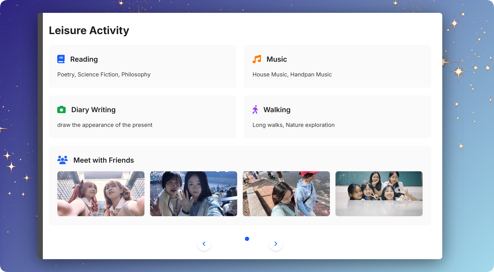
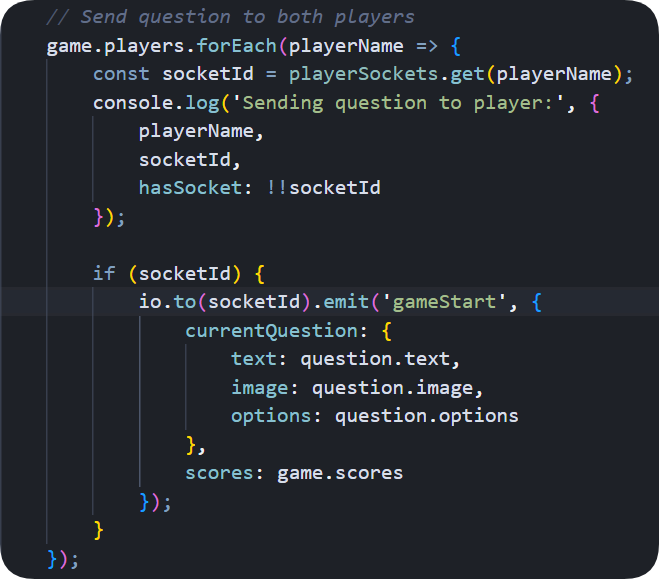
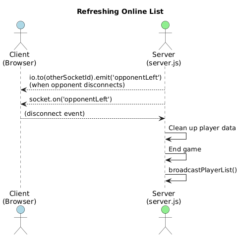

# README

- School: University of Aberdeen & South China Normal University
- Major: Artificial Intelligence
- Name: 
- Student Number: 
- github address(only for static):https://10z1imy.github.io/Akiracore.github.io/
- github address(The whole web application):https://github.com/10Z1imy/Online-Quiz-App

# Run

switch to the category:

```jsx
cd Assignment/
```

if no **node_modules** under the assignment category, run npm install firstly.

if have, run npm start directly.

```jsx
npm install
npm start
```
Then click BOX Url on the top menu.
HAVE A NICE TRIP XD

# ①Overview Structure

### File structure

```jsx
Assignment/
├── Server.js
├── package.json
├── package-lock.json
├── README.md
├── node_modules/
└── src/
    ├── html/
    │   ├── Homepage.html
    │   ├── AboutMe.html
    │   ├── Artworks_Wings.html
    │   ├── OnlineGame.html
    │   └── Mytrace.html
    ├── styles/
    │   ├── base.css
    │   ├── styles.css
    │   ├── homepage/
    │   │   ├── homepage_page1.css
    │   │   ├── homepage_page2.css
    │   │   ├── music-player.css
    │   │   ├── theme.css
    │   │   ├── gacha-machine.css
    │   │   └── navigation.css
    │   ├── OnlineGame_Page/
    │   │   ├── game-theme.css
    │   │   ├── game.css
    │   │   └── login.css
    │   └── Artworks_Page/
    │       └── wings.css
    ├── scripts/
    │   ├── scriptnav.js
    │   ├── machine.js
    │   ├── lyricsscript.js
    │   ├── wings.js
    │   └── rolling.js
    └── assets/
        ├── music/
        │   ├── Revive.mp3
        │   ├── replay.mp3
        │   └── falling.mp3
        └── img/
            ├── person/
            ├── walk1.jpg
            ├── party.jpg
            ├── first.jpg
            └── etc...
```

### Web structure


# **②Project Overview**

## **1. Technology Stack**

- Frontend: HTML, CSS, JavaScript
- Backend: Node.js (Express)

## **2. The navigation system**

- Five Responsive Pages with an **auto-hiding sidebar navigation:**
    - Collapsed by default on the left edge of the viewport
    - Expands on hover with smooth transition animations
    - Enables seamless cross-page navigation


## **3. aesthetic design(consistency)**

The webpage maintains excellent consistency in concept, color scheme, component styles and responsiveness. 

**Concept** : The core concept is to express that users enter the "my" spiritual universe and view my inner world, which is reflected in the "mental port" text on the homepage and the introductory text on the About Me page. 

**Color Scheme :** Guided by style keywords like "sci-fi", "universe", "galactic" and "gamified elements", the color scheme uses Klein blue and purple as primary tones, complemented by iridescent colors and yellow star motifs – galactic elements appear on almost every page. For example, the homepage (homepage.html) includes a slot machine for playful interaction, while onlinegame.html incorporates more gamified elements (pixel art and medal icons) that blend seamlessly with the sci-fi cosmic theme, creating an immersive experience of playing mini-games in space. 

**Component Styles :** All container components adopt a white rounded-corner design to reduce reading fatigue. 

**Responsiveness :** Responsive design is achieved via @media queries to control proportions and breakpoints, ensuring adaptability across devices and optimal usability.

## **4. Page Breakdown(5 pages)**

### **4.1 Homepage (Root)**

- The homepage features a full-screen scrolling container architecture. It consists of two independent sections with smooth parallax scrolling effects powered by CSS Bezier [curves.**You](http://curves.You) should roll up or down to see the 2 sections.**
    
#### **Section 1: Interactive Showcase**
    
- Central creative poster display
- Music player with dynamic lyrics visualization
- Adjustable lyric animation parameters (inside icon，about trajectory, angle)
- Interactive slot machine game:
    - Pull lever to receive random items
    - Click items to view associated stories
            

            
    
#### **Section 2: Personal Information**
    
- Clean card-based layout displaying:
    - Basic information (name, age, contact)
    - Professional skills & expertise
            

            

### **4.2 Aboutme Page**

- This page shows more detailed information about me. I choose book-inspired layout with page-turning animations，presenting personal information in distinct chapters。Each chapter covers different content like skills and hobbies. Users can switch chapters by scrolling or clicking markers, and the system remembers their progress.
    

    

### **4.3 Online game Page**

- The online game page is divided into three smooth-flowing scenes: Login, Lobby, and In-Game. Registered users can find opponents to compete with. (The full application will be detailed in a separate section below.)


### **4.4 Artworks Page（Extra）**

- **As an illustrator, i put my favorite artworks in this page and design great CSS animation to make sure you can enjoy the [interactions.You](http://interactions.You) can click the play button to have some music, and roll up or down to switch the drawing presenting above.**


### **4.5 Diary Page（Extra）**

- Here is my diary, recording my mindthoughts and activations. Aiming at making a vibe of shuttling time,The webpage uses a flex layout to display the timeline effect, and the diary cards adopt a grid layout. Users can view diaries from different periods by clicking on different icons.
    

    

# ③Quiz Application: Event Driven Pattern & Socket.io

I divided the game functionality into three pages: the login page, lobby page, and game page.

In the game process, all event emissions and listeners, including the logic of the broadcast mechanism, are implemented by  `server.js`  (acting as the server) and the inline JavaScript in `Onlinegame.html` (acting as the client).


Now, I will introduce the application of [Socket.io](http://socket.io/) and event handling in the two sides from the perspective of a complete game process, while also covering page display.

**Step 0: Server Initialization**

First, we centralized all backend logic in server.js. To avoid modifying previous paths, we configured static resource routes using route mapping. At the same time, we confirmed the creation of an HTTP server to bind the Socket.IO mechanism.

**Step 1: Login (Verify Uniqueness, Initialize Player Model)**


When the webpage is opened, the server listens for the `connection` event sent by the client. On the login page, the user needs to enter a username and press the Enter key, which is bound to the `login` event.


***Player data model***
(This project stores and updates unique user information through a `Player` class, using multiple `Map` data structures to store player attributes (facilitating tracking of player status: online status, historical game data) **[lines 81-146]**. Each client is initialized with a `Player` object containing a unique `socketId`, with the `socketId` used to reference different clients thereafter. Usernames undergo uniqueness verification; if verification fails, a "username already exists" message is displayed. Upon successful verification, the `Player` object is initialized, and relevant user information is written into the `Map` data structure.)

At this point, the client emits a `login` event to the server. The server's `socket.io` successfully listens for the specific `login` event, executes the corresponding function, and returns a `loginresponse` event. The client receives this event, hides the login page, and updates the user's status.


At this point, the user enters the game lobby. The left side displays the ranking list and personal data, while the right side shows the list of currently online players (implemented via the `broadcastPlayerList` function). Users can select an account and click the "Challenge" button, which binds a [Socket.IO](http://socket.io/) event via the `onclick` attribute to send a `challengePlayer` event to the server, carrying the target player's name (e.g., `socket.emit('challengePlayer', '${player.name}')`).


**Step 2: Challenge Invitation**


When the server detects that User A wants to challenge User B, it immediately checks User B's status. If User B is online, the server sends a `challengeRequest` event to prompt a response.


When the challenged party in the client listens to the `challengeRequest` event, an invitation message is refreshed on the current page. The invitation message has an "Accept" button and a "Decline" button, which are bound to the `acceptChallenge` and `declineChallenge` functions respectively. Pressing the button will trigger an event message containing the challenger's information to the server.


When the server receives the event, if it's an acceptance, it calls the functions to start the game (`createGame` & `startNewQuestion`). If it's a rejection, it returns a rejection message to the client (this event will be listened for on the client side, triggering a styled "Rejected" popup to refresh).


**Step 3: Gameplay ( Question Delivery and transmit answer & scores)**


The `createGame` and `startNewQuestion` functions are called (only partial shown). These two functions create the initial game environment, send a `gameStart` event to the clients of the two participating socket IDs, and simultaneously send a question from the question list.



When the client receives the `gameStart` event, it calls the `showQuestion` and `updateScore` functions to display the question interface.


Simultaneously, option elements are created. When the user clicks on an option in the client, a `submitAnswer` event is emitted to the server.


When the server receives this event, it invokes the `evaluateRound` function to compute the score logic. (The calculation only commences after both players have submitted their answers.) I've rigorously adhered to the score settings specified in the assignment

Game scoring rules: The first correct answer scores 2 points and ends the round. In all other cases, answering incorrectly will definitely give the opponent 1 point.If neither side answers, neither scores.

These scores are ultimately stored in the `game` object for later retrieval. Concurrently, the server sends a `roundResult` event with the round outcome to the client. Upon detecting the `roundResult` event, the client  conceals the result after 5 seconds，and find new question after 8 seconds.


The `evaluateRound` function continues by updating the index of the current question and then chaining a call to `startNewQuestion`. The sequence is: `evaluateRound` → end of rest period → `startNewQuestion` (next question), repeating this process until all questions are exhausted. Once all questions are used, the `endGame` function is invoked, sending an `endGame` event to the client.


When the client detects the `endGame` event, it generates a final results screen that uses template syntax to dynamically populate statistical data from the previously defined storage structures.


**Step 4: Return to Lobby (Update Broadcast Status)**

When the user clicks the **Return to Lobby** button, it triggers a series of functions to clear the game state. Concurrently, the `updatePersonalStats` function is invoked to refresh personal performance records (ensuring data updates for both the ranking list and personal stats pages), before navigating back to the game lobby.


**Step X: (Other Event Transmissions During Gameplay)**

**Q1：How to Maintain the Online List?**


**A：**
We maintain the list of online players on the server-side. Specifically, when a player logs in, we call `broadcastPlayerList` **[Server.js:line147-164]**, which performs a dual broadcast to all clients through both the `playerList` and `rankList` events. When clients receive the `playerList` event **[OnlineGame.html:line650-691]**, they generate a block-style display of account names on the current page and identify players based on their current status.
Additionally, in the game creation function **[Server.js:line165-200]**, we update the player's status and trigger a broadcast update to ensure that other players in the lobby (who have not started a game) can capture changes in account status((e.g., if a player is currently in a game, the block-style account display will show an "in game" indicator).). 
**When the server receives a client's disconnect signal,** we first notify their opponent through the `opponentLeft` event **[OnlineGame.html:line891-897]** if they are in a game, and then force a list refresh by broadcasting both `playerList` and `rankList` events to all remaining clients to ensure synchronized player status across the lobby.




**Q2：How to Broadcast Timer Logic?**

**A：**The question timer is set in the critical `startNewQuestion` function **[Server.js:line200-250]** with a 10-second answering period. After 10 seconds, the `evaluateRound` function **[Server.js:line250-300]** for round result evaluation is automatically triggered (if both players have answered before the timer ends, `evaluateRound` will be triggered early; if neither has answered, the next question will begin). 
Meanwhile, a `timer` event is sent to specific clients, which, upon listening for the `timer` event **[OnlineGame.html:line850-891]**, will generate a timer display on the current page and use animations to show the passage of time. 

The rest period (8 seconds) is implemented using `setTimeout`. When the rest period ends, a new question starts or the game ends directly.


# **④Reflection**

**Challenges Faced**

When building the lyrics playback function for the homepage from scratch, I encountered many issues. For example, the generation position and animation of lyrics were far beyond the webpage viewport. I solved this **by accurately positioning CSS keyframes and setting a 15% dispersion degree** in the lyrics generation function. Additionally, the page was very laggy during testing. After troubleshooting, I found that the continuously generated lyrics were hogging memory, so I added logic to fade out and destroy lyrics when they touched the screen border, which restored normal page performance.

**Lessons Learned**

- I learned how to **connect the web application to the MongoDB database (using Mongoose) taught in class to store** and update user information. However, due to the need for additional database configuration in the Codio environment, I eventually switched to using a **Class-based data structure** to store user information. Storing data directly in server memory without relying on the file system has the drawback of no**t supporting permanent persistence—**previous user names and messages will not be retained after restarting `npm start`.
- **I also realized the necessity of routing.** Initially, I developed with a local editor and previewed using Live Server, which is a local HTTP server that maps your local directory to resources accessible via HTTP, allowing browsers to directly access local files and directory structures. Later in development, I found that Node.js does not automatically handle this; **routing must be configured through code (e.g., Express's static resource middleware)** to enable clients to access local files via HTTP requests. This is a key difference **between Node.js and static servers.**

# ⑤Reference

I primarily used font styles, CDN-hosted CSS libraries, and generative AI tools.

1. [https://getbootstrap.com/docs/5.1/](https://getbootstrap.com/docs/5.1/)
2. [https://fontawesome.com/v6/docs/](https://fontawesome.com/v6/docs/)
3. https://cdnjs.cloudflare.com/ajax/libs/font-awesome/6.0.0/css/all.min.css
4. https://cdnjs.cloudflare.com/ajax/libs/font-awesome/6.7.2/css/all.min.css
5. https://cdn.jsdelivr.net/npm/bootstrap@5.1.3/dist/css/bootstrap.min.css
6. https://cdn.socket.io/4.5.4/socket.io.min.js
7. https://cdn.tailwindcss.com
9. The photos in my app are painted by myself. The others are my pictures.No infringing images.
10. I use FIGMA to create the poster on the root page.
# ⑥AI Tools
GenAI usage scene:
### 1. Doubao  
**Tool Name**: Doubao  
**Usage Scenarios**:  
- **Knowledge Point Supplement**: Confirm the usage of attributes in the HTML5 `audio` tag (e.g., `controlsList` to disable default controls, `preload` loading strategies).  
- **Logic Clarification**: Sort out the synchronization logic between lyric scrolling and audio playback (e.g., matching lyric lines by monitoring timestamps via `audio.currentTime`).  

**Prompt Summaries**:  
- Prompt: "How to hide the default play button in the HTML5 audio tag? How to disable the long-press pop-up menu on mobile devices?"  
- Prompt: "In JavaScript, how to achieve real-time matching between a lyric array and audio timestamps? Please provide a pseudocode outline."  

**Generation Date and Version**: May 15, 2025 (current version of Doubao)  
**Personal Modification Notes**:  
- Referenced Doubao's prompt about the `controlsList="nodownload noremote"` attribute and manually wrote the HTML structure without directly copying code.  
- Adjusted the pseudocode logic based on personal thinking, using `setInterval` for timed timestamp comparison instead of the tool-recommended `requestAnimationFrame`.  


### 2. Cursor  
**Tool Name**: Cursor  
**Usage Scenarios**:  
- **Code Error Identification**: Fix styling flickering during lyric scrolling (abnormal CSS transition effects).  
- **Syntax Check**: Correct index out-of-bounds errors in JavaScript lyric arrays (e.g., `lyrics[i+1]` without null checking).  

**Prompt Summaries**:  
- Prompt: "Why is the CSS transition property `transition: all 0.3s` ineffective during lyric switching? What might be the cause?"  
- Prompt: "Check this code: `for (let i=0; i<lyrics.length; i++) { if (time >= lyrics[i].time) scrollTo(i) }`. Does it have performance issues?"  

**Generation Date and Version**: May 15, 2025 (Cursor v1.5.23)  
**Personal Modification Notes**:  
- Discovered through Cursor's prompt that the parent element lacked proper `overflow: hidden` configuration, manually added it to resolve the flickering issue.  
- Adopted the tool's optimization suggestions (e.g., caching lyric nodes in advance), but the specific implementation was written personally without directly using generated code.  